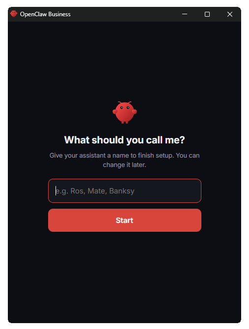
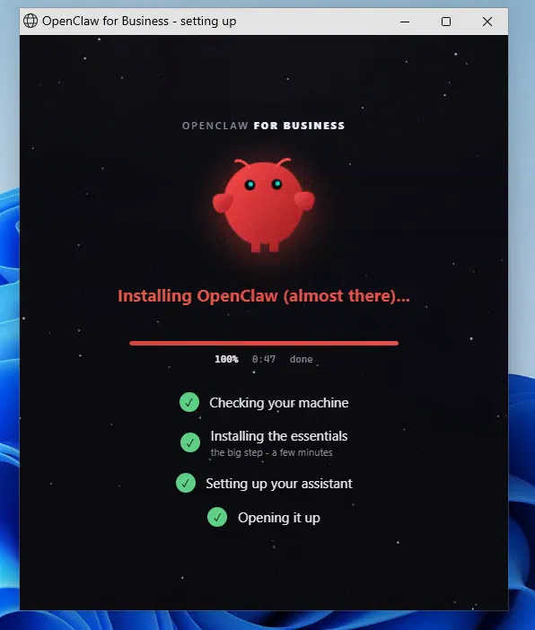
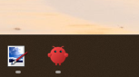
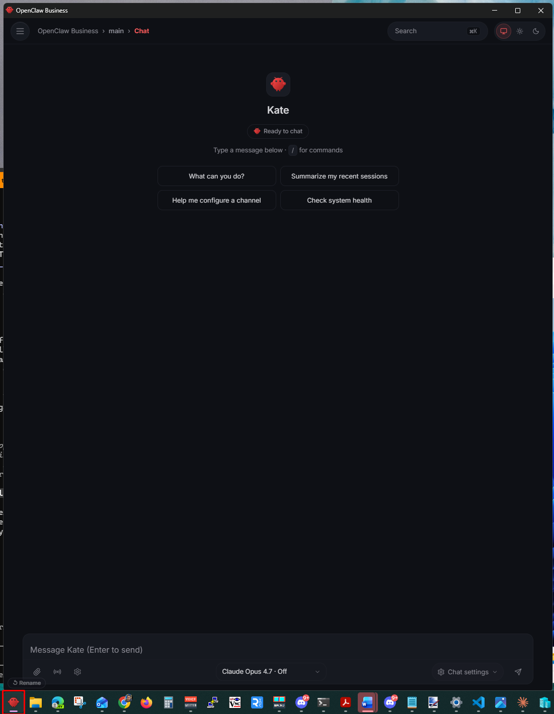

# erban — OpenClaw on your machine, one click

**erban** is a one-click installer that puts [OpenClaw](https://openclaw.ai) (the open-source AI
assistant, MIT) on a Windows PC — no terminal, no config, no IT person. You click once, give your
assistant a name, and it opens in a tidy chat window pinned to your taskbar.

The clever bits are OpenClaw's. erban just makes it **install itself, behave on a real machine, and
stay out of your way**.

> Live at **[erban.xyz](https://erban.xyz)**. Windows only for the one-click corner window; there's a
> `install.sh` for macOS/Linux that gives you the same agent via `openclaw dashboard`.

## Watch it in action

[](https://youtu.be/85Y3259aCEs)

---

## Install

**One line** — paste into Command Prompt, PowerShell, or the Run box (Win+R):

```powershell
powershell -NoProfile -Command "irm https://erban.xyz/install.ps1 | iex"
```

**Or** download **[OpenClaw-for-Business-Setup.exe](https://erban.xyz/OpenClaw-for-Business-Setup.exe)**
and run it.

> **Heads up:** the `.exe` is unsigned for now, so Windows SmartScreen flags an "unknown publisher"
> the first time — click **More info → Run anyway**. Code-signing is on the way.

---

## What you get

### 1. Name your OpenClaw agent

On first run a small window asks what to call it. Pick a name — that's the setup done.



### 2. It sets itself up

A friendly installer checks your machine, installs OpenClaw and everything it needs (Node, Chrome for
a clean app window, the model engine), works around whatever's already on the PC, and shows you where
it's up to as it goes.



### 3. Pinned to your taskbar

OpenClaw installs with its **own icon on your taskbar**. Close the window and OpenClaw closes with it —
but the icon stays pinned, so your agent is **one click away any time** you want it.



### 4. Your agent, in the corner

Click the icon and it opens in a clean chat window in the **bottom-right of your screen** — a tidy app
window (a headless Chrome `--app` window), no tabs, no address bar. Talk to it, close it, open it
again. It's always right where you left it.



---

## Why it's built this way

- **No terminal, no config.** The installer *is* the setup. It adapts to your machine instead of
  asking you to. If something's off, it sorts it and logs what it did.
- **Everything in one folder.** App, settings and logs all land under `C:\OpenClawBusiness\` — one
  place you can see, back up, or remove. Nothing buried deep in the system.
- **Your machine, your model.** Runs on your own PC. Use Claude, or bring your own model.
- **Built on OpenClaw.** It's a thin one-click wrapper. The agent runtime, gateway and Control UI are
  all OpenClaw's — we don't rebuild any of it.

---

## How the install works

`install.ps1` does everything under **`C:\OpenClawBusiness\`** (`app`, `profile`, `browser`, `logs`,
`ui`):

1. Opens a friendly progress window instantly (it's embedded, no download needed).
2. Installs **Node**, then **OpenClaw** (`npm i -g openclaw`), then **Chrome** (so the corner box
   shows OpenClaw's own taskbar icon), then the **Claude engine**.
3. Downloads the app bundle (`erban.xyz/erban-assets.zip` — a zip of this repo's `surface/` +
   `agent/`).
4. Writes the OpenClaw config + gateway launcher, registers the **gateway / surface / watchdog**
   scheduled tasks and a firewall rule.
5. Names your assistant and opens the corner chat box.

The installed agent is plain OpenClaw — named, set up, ready to chat.

## Repo layout

| Path | What it is |
|------|------------|
| `installer/` | The published installers — `install.ps1` (Windows) and `install.sh` (macOS/Linux). The `.exe` and `erban-assets.zip` on the site are **build artifacts** of this source. |
| `surface/` | The corner box: `launch-surface.ps1` (the chromeless `--app` launcher), the rebranded OpenClaw Control UI under `control-ui/` with the injected `erban-overlay.{css,js}`, the first-run naming + provider sign-in helper under `identity-service/`, and `erban-uninstall.ps1`. |
| `agent/workspace/` | The agent's workspace files (`SOUL.md`, `AGENTS.md`, `IDENTITY.md`, …) injected into its system prompt. |
| `site/` | The landing page served at erban.xyz, plus the screenshots above. |
| `CLAUDE.md` | Build spec — what the installer does and the conventions it follows. |
| `architecture.md` | Short design overview. |

### Build artifacts (not committed)

Produced from this source, hosted on erban.xyz, and kept out of git (derivable, avoids binary drift):

- `erban-assets.zip` — a zip of `surface/` + `agent/`, downloaded by `install.ps1`.
- `OpenClaw-for-Business-Setup.exe` — a `ps2exe` wrapper of `installer/install.ps1`.

See `site/README.md` for the Cloudflare Pages hosting + deploy details.

## Built on OpenClaw

[OpenClaw](https://openclaw.ai) is the open-source AI assistant doing the real work. erban is the thin
layer that makes it install itself in one click, behave on a real machine, and stay out of the way.
